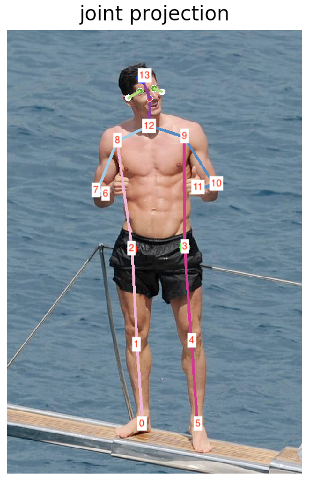
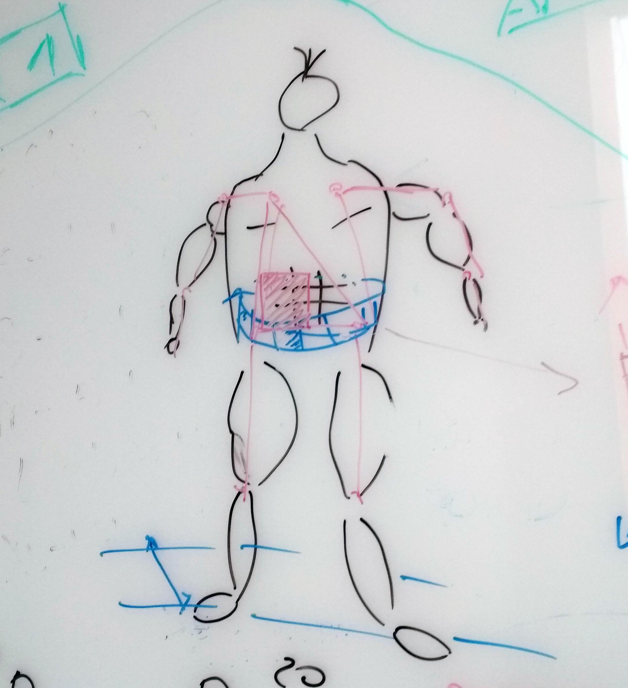
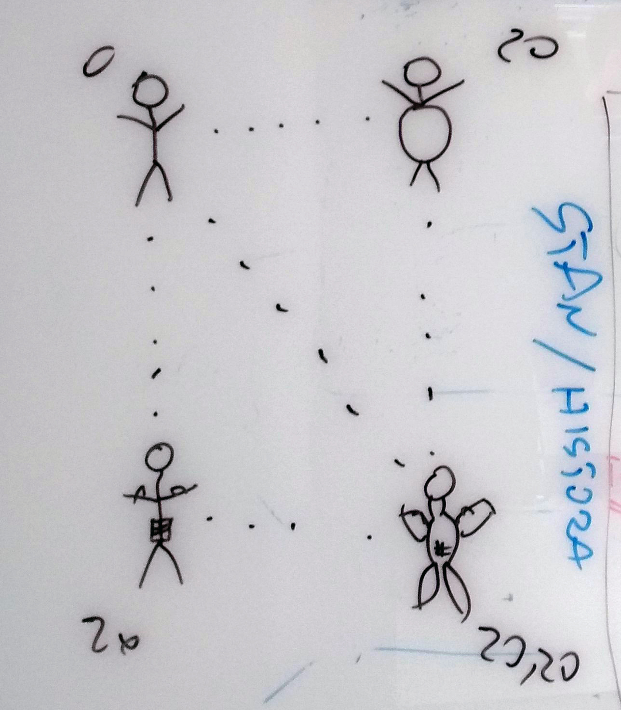

# :muscle: __Słonie w pontonie__ :muscle:



### Wprowadzenie

Aplikacja dla osób trenujących. Pozwala śledzić progres treningu przy jednoczesnej kontroli stanu zdrowia. Na podstawie serii zdjęć, za pomocą sieci neuronowych analizuje objętość i kształt mięśni oraz posturę, zwracając uwagę na ostrzeżenia chorobowe (takie jak otyłość, skrzywienia kręgosłupa, rak skóry).

### Funkcje

- analiza objętości i kształtu mięśni
- klasyfikacja sylwetki na skali
- wizualizacja progresu i statystyki
- możliwość wyznaczenia przez klienta celu i dopasowanie treningu
- analiza postury
- ostrzeżenia chorobowe

### Założenia aplikacji


<i>Analiza stanu ciała ze zdjęcia</i>

<i>Umieszczenie sylwetki na skali</i>


```
$ pipreqs . --ignore hmr                        # generacja listy pakietow
$ pip3 install -r requirements.txt --no-index   # instalacja pakietow
$ autopep8 --in-place --aggressive --aggressive <filename>  # czystosc
$ python3 debug.py  # szybki wizualny debug na "lewym"
```
