# :muscle: __Słonie w pontonie__ :muscle:


### Wprowadzenie

Aplikacja dla osób trenujących. Pozwala śledzić progres treningu przy jednoczesnej kontroli stanu zdrowia. Na podstawie serii zdjęć, za pomocą sieci neuronowych analizuje objętość i kształt mięśni oraz posturę, zwracając uwagę na ostrzeżenia chorobowe (takie jak otyłość, skrzywienia kręgosłupa, rak skóry).

- analiza objętości i kształtu mięśni
- klasyfikacja sylwetki na skali
- wizualizacja progresu i statystyki
- możliwość wyznaczenia przez klienta celu i dopasowanie treningu
- analiza postury
- ostrzeżenia chorobowe

### Skutecznosc ML

Ponizej prezentujemy rezultaty sieci do analizy **stopnia rozbudowy/masy
miesniowej/tluszczu**.

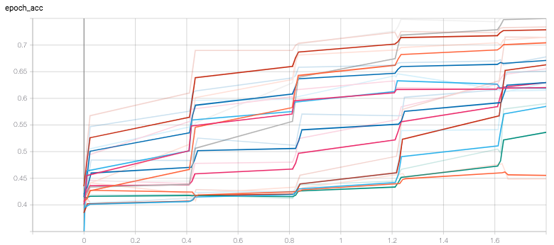
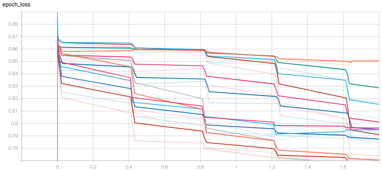

Skutecznosci podane w tabeli (osobny model dla osobnego miesnia/czesci ciala):

| Net (spec.)   |      Acc.     | Net (spec.)   |      Acc.     | Net (spec.)   |      Acc.     |
|---------------|:-------------:|---------------|:-------------:|---------------|:-------------:|
| prawe_ramie   | 0.78          | prawe_udo     | 0.78          | prawa_lydka   | 0.63          |
| lewe_ramie    | 0.71          | lewe_udo      | 0.74          | lewa_lydka    | 0.62          |
| lewy_abs      | 0.52          | prawa_klatka  | 0.80          | prawy_biceps  | 0.72          |
| prawy_abs     | 0.73          | lewa_klatka   | 0.76          | lewy_biceps   | 0.81          |

### Preprocessing (dane 3d/auto. maska/postura)

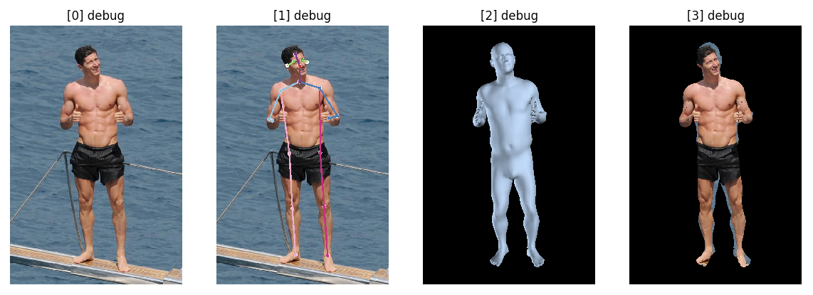

### Dekompozycja elementow ciala

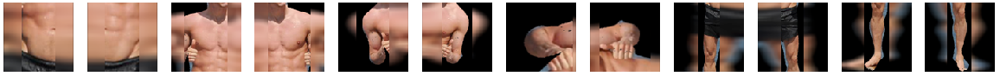

### PudzianNet Dataset (przyklad dla prawy_abs/gradient)

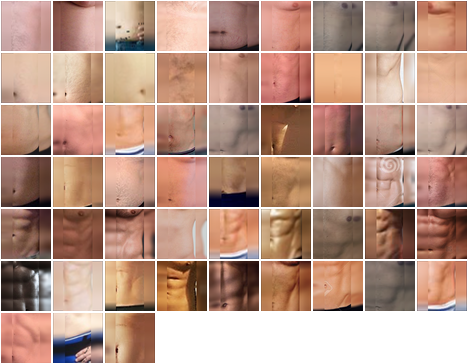

### Dane wejsciowe dla serii w czasie (np. po treningu)

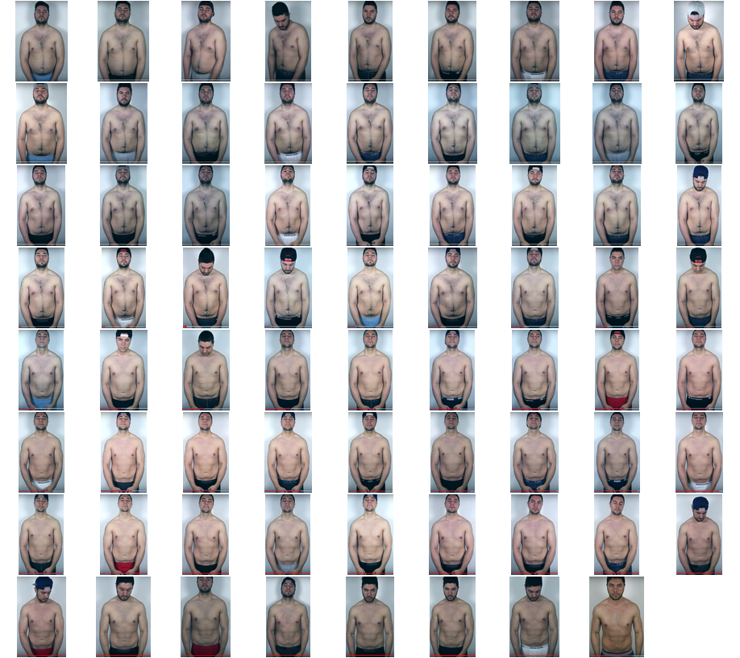

### Analiza w czasie progresu treningu (czarna linia/tendencja)

> ciekawostka, wyszlo ze lewa strona jest **nie dotrenowana**
> okazuje sie ze analizujac zdjecia **w istocie tak jest**!!!
> SUKCES NASZEGO PROJEKTU! WLASNIE PO TO ISTNIEJE

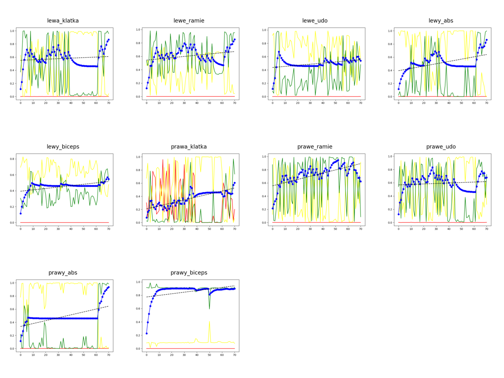

### Tendencje jako wspolczynniki

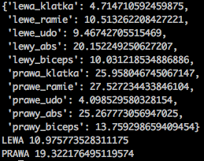

### Założenia aplikacji

<i>Analiza stanu ciała ze zdjęcia</i> | <i>Umieszczenie sylwetki na skali</i><br>


<br><br>

### Bonusy

<i>Wersja alpha mobilnej aplikacji</i> | <i>Wyjasnienie do stwierdzenia</i><br>
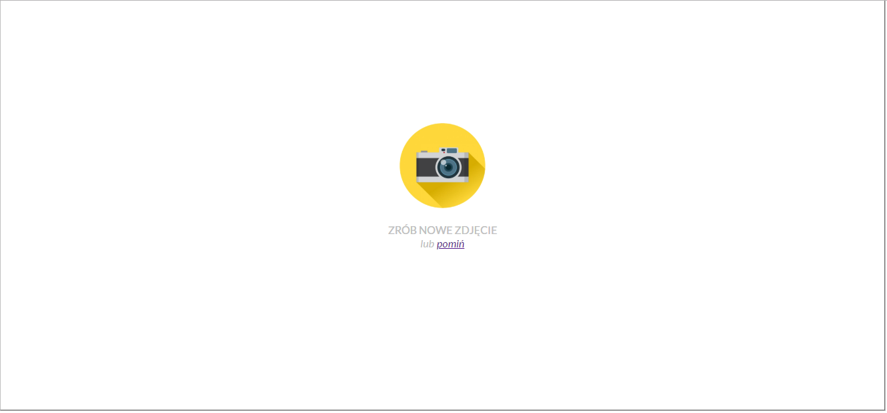
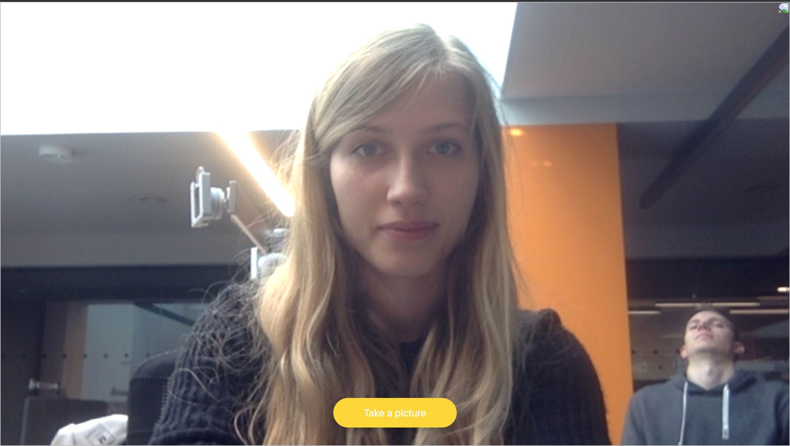
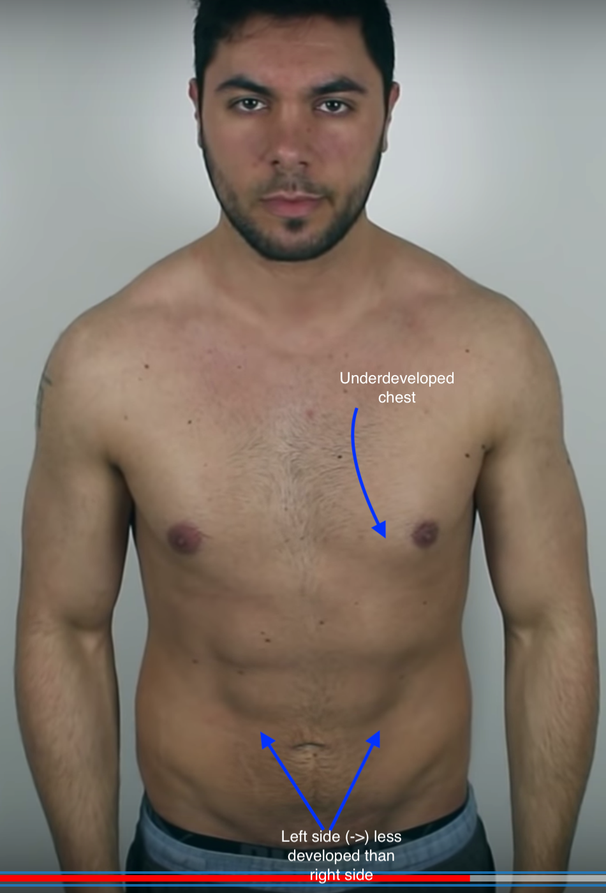
<br><br>

```
$ pipreqs . --ignore hmr                        # generacja listy pakietow
$ pip3 install -r requirements.txt --no-index   # instalacja pakietow
$ autopep8 --in-place --aggressive --aggressive <filename>  # czystosc
$ python3 debug.py  # szybki wizualny debug na "lewym"
$ python3 time.py; open html/index.html # budowanie raportu
```
